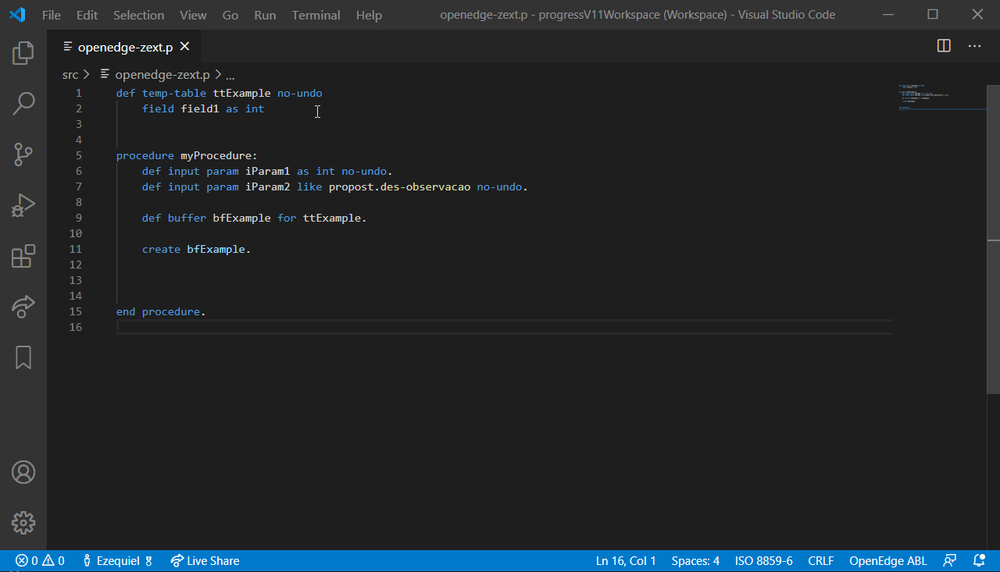
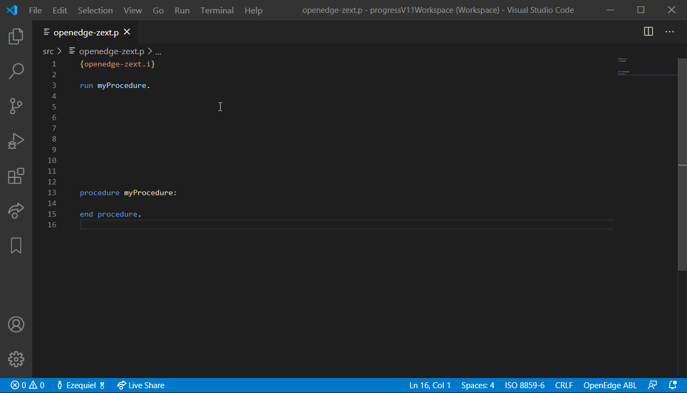

# OpenEdge-ZExt - Visual Studio Code extension for OpenEdge ABL

OpenEdge ABL Extension for Visual Studio Code

## Features

- Syntax highlighting
- Auto-complete (tables, fields, methods, variables, parameters)
- Source navigation (ctrl+click)
- Check syntax, compile, run
- Deploy (source / r-code)
- Source formatting
- Hover information
- Code snippets

### Auto-complete
> *Supports database table/fields, temp-tables, buffers, methods*


### Source navigation
> *Navigate throught includes, declarations*


### Check syntax, Compile, Run, Deploy
- Check syntax `Shift+F2`
- Compile (and deploy) `Alt+F1`
- Compile (and deploy) with options (xref, debug-list, xcode, etc) `Alt+F3`
- Deploy without compile `Alt+F2`
- Compile and run `F2`
> *Deployment options are located in configuration file*

### Source formatting
- Available commands:
    - `ABL: Format - Keywords - Upper Case`
    - `ABL: Format - Keywords - Lower Case`
    - `ABL: Format - Trim Right`

### Hover information
- Provides information when mouse hovers an element (table, field, variable, etc)

### Command Palette
-

### Shortcut Keys
- 

### Other features

#### Code folding
- Uses `//#region` and `//#endregion` code folding - same as TypeScript

## What's new

### 1.0.0
- Brand new source code (seriously... like 90%...)

### 0.6.0
- New commands for source formatting

See [CHANGELOG](CHANGELOG.md) for more information.

## Requirements

- OpenEdge Progress 11

## Usage
- Extension is activated for extensions: .i .p .w .cls

### Starting
- Create a configuration file (see Extension Settings below)
- Execute command "ABL: Read Dictionary Structure" for auto-complete feature
- Enjoy...

### Commands

#### ABL: Read Dictionary Structure
> Create a database auto-complete file

#### ABL: Check Syntax (Shift+F2)
> Check syntax for current file and highlights errors

#### ABL: Compile & Deploy (Alt+F1)
> Compile the current file and deploy the RCode when configured

#### ABL: Deploy Source (Alt+F2)
> Deploy the current file when configured (without compile)

#### ABL: Compile with Options (Alt+F3)
> Compile the current file with additional options (Preprocess, X-Ref, etc)

### Other features

#### Format source code

- Trim: *remove whitespaces from the end of the lines*

## Extension Settings

Create a file named ".openedge-zext.json" in root path of the workspace.
> Download base configuration file [here](resources/examples/.openedge-zext.json).

```JSON
{
    "workingDirectory": "${workspaceFolder}\\Temp",
    "proPath": [
        "c:\\src",
        "${workspaceFolder}"
    ],
    "proPathMode": "overwrite", // append, prepend
    "dlcPath": "c:\\dlc116",
    "parameterFiles": [
        "default.pf"
    ],
    "dbDictionary": [
        "myDatabaseForAutoComplete"
    ],
    "deployment": [
        {
            "taskType": "current.r-code", // current.source
            "path": "c:\\out",
            "postAction": [
                {
                    "actionType": "URL",
                    "command": "http://localhost:8080/postAction"
                }
            ]
        }
    ]
}
```

- `dlcPath` is optional, and overwrite DLC enviorenment variable
- `dbDictionary` are the logical names of database files for the auto-complete option (command: ABL Read Dictionary Structure)
- `deployment` are actions from compile/deploy commands (Alt+F1, Alt+F2 and Alt+F3)
- `format` are formatter options
- Default values:
    - `proPath`: workspaceRoot
    - `workingDirectory`: folder of active source file

## Known Issues & Enhancements

Visit [Issues page on GitHub](https://github.com/ezequielgandolfi/openedge-zext/issues) to report any problem or submit an enhancement.

## Greetings
Grammar file based on Christophe Camicas' (https://github.com/chriscamicas/abl-tmlanguage.git)

## License
Licensed under the [Apache-2.0](LICENSE) License.
